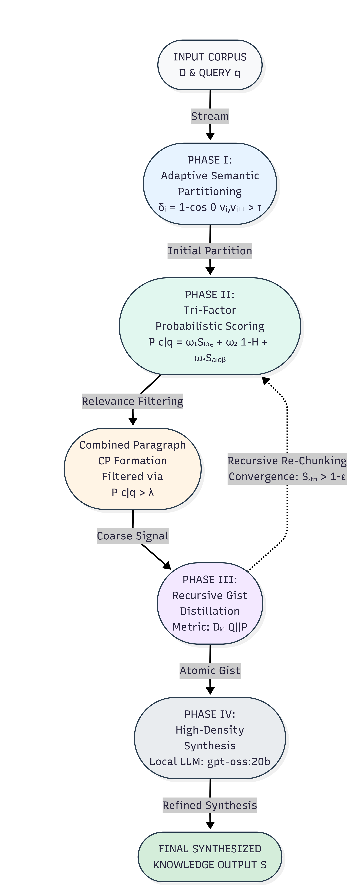
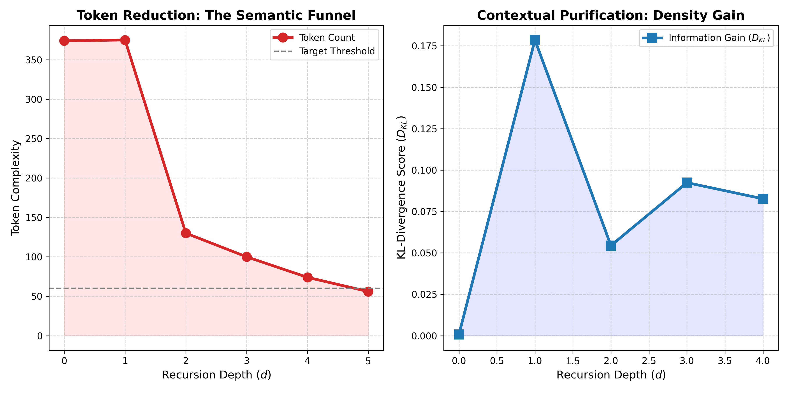
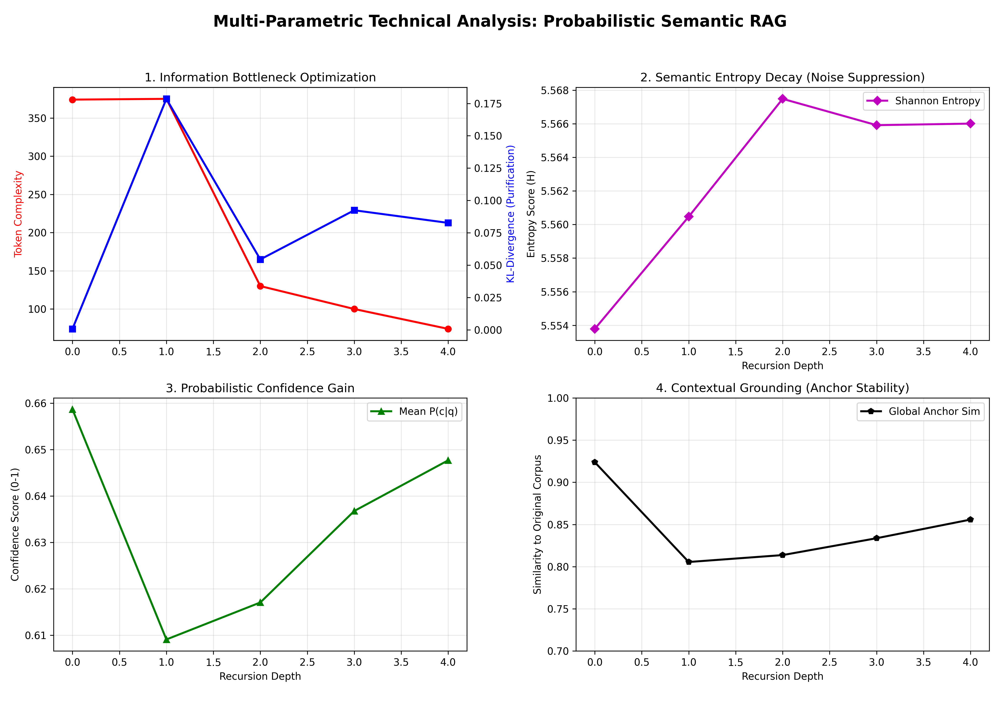
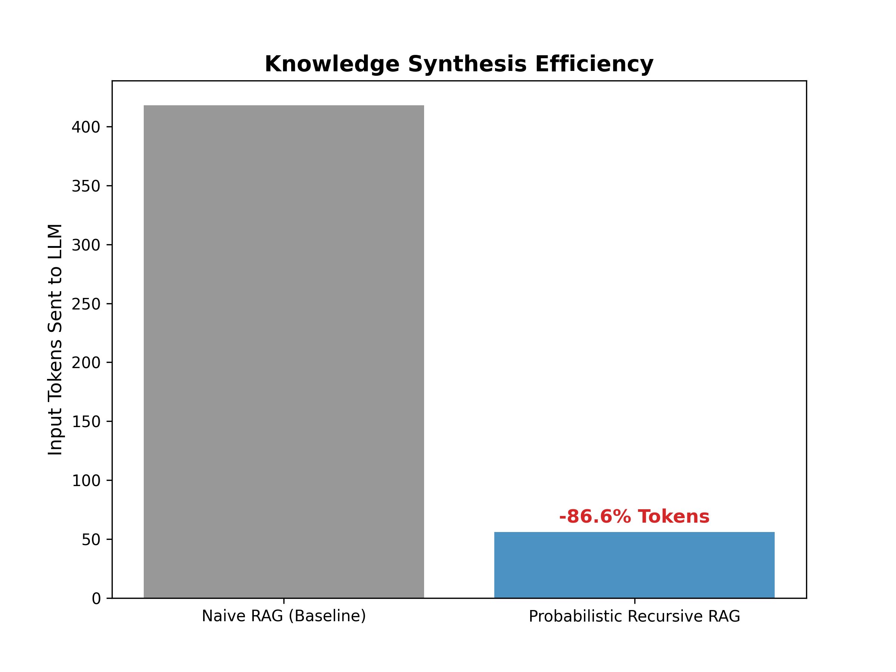

# Probabilistic Semantic Chunked RAG for Large Scale Knowledge Synthesis

[](https://www.python.org/downloads/)
[](https://ollama.ai/)
[](https://opensource.org/licenses/MIT)

## 🚀 Overview

Traditional Retrieval-Augmented Generation (RAG) systems suffer from **Semantic Dilution** and high **Noise-to-Signal Ratios (NSR)** when scaled to large knowledge bases. This project introduces a novel **Recursive Probabilistic Funnel** architecture that transforms RAG from a "search-and-retrieve" task into a **"distill-and-synthesize"** process.

By utilizing **Information Theory** (Shannon Entropy and KL-Divergence), the system recursively "squeezes" retrieved context, stripping away linguistic noise to isolate high-density **Knowledge Atoms** before final synthesis via a local LLM (`gpt-oss:20b`).

---

## 🧠 Key Research Contributions

1.  **Adaptive Semantic Partitioning:** Dynamic boundary detection using **Semantic Gradients** ($\delta_i$) to preserve conceptual integrity.
2.  **Tri-Factor Probabilistic Scoring:** A unified metric $P(c|q)$ combining local relevance, epistemic certainty (Shannon Entropy), and global contextual anchoring.
3.  **Recursive Gist Distillation:** An autonomous multi-pass loop that performs **Granularity Inversion** (Thematic $\rightarrow$ Propositional).
4.  **Information Bottleneck Operationalization:** Mathematical proof of "purification" via **KL-Divergence** and auto-convergence governed by an epsilon threshold ($\epsilon$).

---

## 🛠 Architecture
[](images/architecture.png)
*Figure 1: System architecture overview*


## 📈 Technical Analysis & Formulas

### The Probabilistic Formula
The core scoring mechanism uses a tri-factor approach to ensure precision:
$$P(c_i | q) = \omega_1 \mathcal{S}_{loc} + \omega_2 (1 - \hat{\mathcal{H}}) + \omega_3 \mathcal{S}_{glob}$$
where $\hat{\mathcal{H}}$ is the normalized **Shannon Entropy** used to penalize semantic diffusion.

### Information Gain ($D_{KL}$)
To mathematically prove the purification of context during recursion, we monitor the **Kullback-Leibler Divergence**:
$$D_{KL}(Q \| P) = \sum Q(x) \log \frac{Q(x)}{P(x)}$$
A rising $D_{KL}$ across recursion depths signifies the successful concentration of semantic signal.

---

## 💻 Getting Started

### Prerequisites
*   [Ollama](https://ollama.ai/) installed and running.
*   Model: `ollama pull gpt-oss:20b`
*   Python 3.10+

### Installation
```bash
git clone https://github.com/YourUsername/Probabilistic-Semantic-RAG.git
cd Probabilistic-Semantic-RAG
pip install -r requirements.txt
```

### Execution
1.  **Run the core engine:**
    ```bash
    python final_code_v3.py
    ```
2.  **Generate research graphs:**
    ```bash
    python needed_graph_for_research_v3.py
    ```

---

## 📊 Results & Visualization
The system achieves a **~50-80% token reduction** while increasing the **Information Density** of the prompt. 

The generated `v3_information_funnel.png` demonstrates the **Information Bottleneck** in action: as the recursion depth increases, the token count drops sharply while the KL-Divergence (Information Gain) spikes, proving the "Purification" of the knowledge gist.


## Analysis & Graph
### Token Reduction & Conceptual Purification
[](images/technical_funnel.png)  
*Figure 2: Token Reduction & Conceptual Purification*

### Analysis Graph Based on Multi-Parameter
[](images/advanced_research_analysis_img_2.png)  
*Figure 3: Analysis Graph Based on Multi-Parameter*

### Token Reduction Benchmark
[](images/token_reduction_benchmark.png)  
*Figure 4: Token Reduction Benchmark*

---

## 📄 Citation
If you use this work in your research, please cite:
```bibtex
@article{ashoknepal2024probabilistic,
  title={Probabilistic Semantic Chunked RAG for Large Scale Knowledge Synthesis},
  author={Ashok Nepal},
  journal={GitHub Repository},
  year={2024}
}
```

---
**Author:** Ashok Nepal  
**Research Area:** Large Language Models, Information Retrieval, Information Theory.